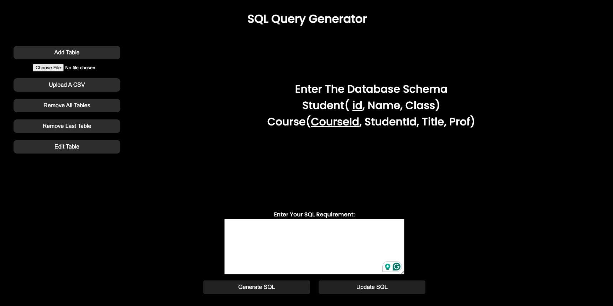
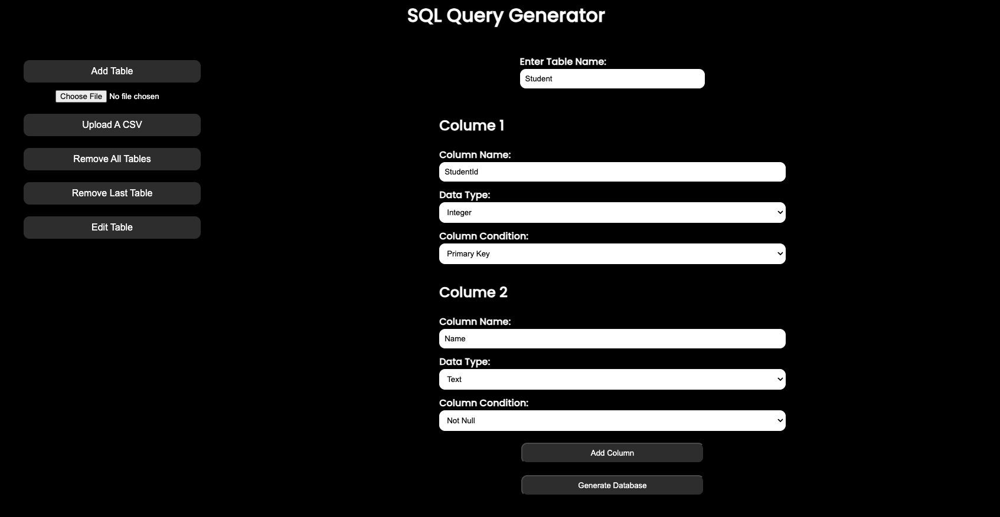

# SQLGenius
> SQL Query Generator Using Large Language Model. Through a user-friendly web application, users input database schemas, feature specifications, and requirements in natural language. SQLGenius will generate the SQL query for developers and non-technical users to get insights from data. This automated process significantly accelerates query creation, benefiting both developers and non-technical users. The project has the potential to revolutionize database interaction, offering an efficient and accessible solution that bridges the gap between natural language and technical SQL code. 

<table>
  <tr>
    <td>
      
    </td>
  </tr>
</table>

## 👨‍💻 Contributors:
-  Tuan (Alan) Le tuanlattnlhp@gmail.com

## 💾 Technologies

- **Frontend**: HTML. CSS, JS
- **Backend**: Python, Flask
- **APIs**: OpenAI API

## 🌟 Features

- **Efficient Entering Database Schema**: The user can define and edit database schema by interacting with the UI or uploading the CSV file containing the data.

  
- **Visualization of Database Schema**: The user can visualize the input database schema as well as the columns of each table.

- **SQL Generation**: The user can enter the requirement in natural language. SQLGenius will gather information from the database schema and users's requirements to generate SQLite code.

## Run the Program by 
``python app.py``
